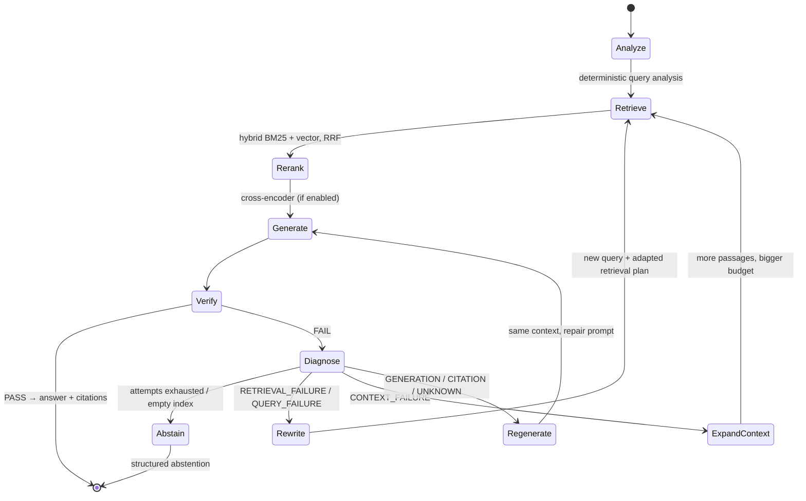

# Self-Healing RAG

The self-healing layer (`src/healing/`) turns the pipeline's single pass
(`retrieve → rerank → generate`) into a closed loop:

```
generate → verify → diagnose → change behaviour → retry → verify again → … → answer | abstain
```

It is **opt-in** (`RAG_SELF_HEALING_ENABLED=false` by default, or `"self_heal": true`
per request) so existing clients keep today's latency and cost profile unless they
ask for it. With healing off, every code path is exactly what it was before.

---

## Architecture




| Node     | Component                                                                                                              | LLM call?      |
| -------- | ---------------------------------------------------------------------------------------------------------------------- | -------------- |
| Analyze  | `query_analysis.analyze_query`                                                                                         | no             |
| Retrieve | `RAGPipeline._retrieve` (vector or hybrid) via `PipelineBackend`; multi-query RRF fusion on broad retries              | no             |
| Rerank   | `RAGPipeline._apply_reranker` — always scored against the **original** question                                        | no             |
| Generate | `Generator.generate` — default prompt on attempt 1, repair prompt afterwards; always answers the **original** question | yes            |
| Verify   | `Verifier` — deterministic checks, then an LLM judge only if those pass                                                | judge only     |
| Diagnose | `FailureClassifier` — pure rules over verifier signals                                                                 | no             |
| Route    | `state_machine.route()` — pure function                                                                                | no             |
| Rewrite  | `QueryRewriter` — LLM with JSON contract, deterministic fallback                                                       | yes (optional) |


### Why not LangGraph?

The graph has five nodes and one routing function. Writing it as a small explicit
loop with a **pure** `route(verification, attempt, max_attempts, last_action, last_failure)`
keeps every transition unit-testable without adding a framework dependency or
duplicating sync/async node implementations. Each component (retrieval, reranking,
generation, verification, rewriting) is independently testable and reached through
the `RAGBackend` protocol, so porting to LangGraph later is a mechanical change.

---

## Verifier

`src/healing/verifier.py` returns a Pydantic `VerificationResult`:

```json
{
  "passed": false,
  "faithfulness": 0.61,
  "relevance": 0.88,
  "citation_valid": false,
  "retrieval_sufficient": false,
  "contradiction_detected": false,
  "is_refusal": false,
  "judge_available": true,
  "unsupported_claims": ["..."],
  "failure_type": "RETRIEVAL_FAILURE",
  "reason": "Retrieved context is insufficient to answer the question (term coverage 20%).",
  "retrieval": {"num_contexts": 5, "top_score": 0.31, "score_kind": "vector",
                "query_term_coverage": 0.2, "missing_terms": ["..."]},
  "citations": {"markers": [1, 4], "out_of_range": [4], "support_ratio": 0.5, "valid": false}
}
```

**Deterministic checks (always on, free):**


| Check                 | Rule                                                                                                                                                                                                                            |
| --------------------- | ------------------------------------------------------------------------------------------------------------------------------------------------------------------------------------------------------------------------------- |
| Empty answer          | whitespace only                                                                                                                                                                                                                 |
| Refusal               | generator used the "cannot find sufficient information" phrasing (en/de/es)                                                                                                                                                     |
| Retrieval score floor | top vector-similarity or cross-encoder score ≥ `RAG_MIN_RETRIEVAL_SCORE`. **Not** applied to RRF scores, which are rank-derived (\~1/(60+rank)) rather than absolute                                                            |
| Citation range        | every `[n]` must satisfy `1 ≤ n ≤ number of passages the generator saw`                                                                                                                                                         |
| Citation presence     | at least one citation                                                                                                                                                                                                           |
| Citation support      | fraction of cited sentences whose content words overlap the passage they cite ≥ `RAG_MIN_CITATION_SUPPORT` (catches misattributed citations)                                                                                    |
| Query-term coverage   | fraction of the query's content terms present in the passages. A hard gate **only when no judge verdict is available**; otherwise advisory, because paraphrased queries can retrieve the right passage with little word overlap |


**LLM judge (`RAG_VERIFIER_ENABLED`):** faithfulness, relevance, context sufficiency,
unresolved contradictions, and unsupported claims — as JSON, validated into
`JudgeVerdict` (scores constrained to `[0, 1]`). The judge runs only when the
deterministic checks pass, so no tokens are spent on an answer that already cites a
non-existent source. If the call fails or returns malformed JSON, the verifier
degrades to deterministic-only (`judge_available: false`) instead of failing the query.

Workflow control never depends on free-form LLM text.

---

## Failure types and repair strategies

Diagnosis is deterministic (`src/healing/failure_classifier.py`), evaluated in this order:


| #   | Failure type         | Signal                                                                                                                         | Repair                                                                                                                             |
| --- | -------------------- | ------------------------------------------------------------------------------------------------------------------------------ | ---------------------------------------------------------------------------------------------------------------------------------- |
| 1   | `RETRIEVAL_FAILURE`  | no passages retrieved                                                                                                          | rewrite query → re-retrieve (wider)                                                                                                |
| 2   | `QUERY_FAILURE`      | retrieval insufficient **and** (query has &lt; 2 content terms, **or** zero query terms appear in any passage)                 | rewrite query → re-retrieve, **dense-leaning** fusion (α + 0.25) since embeddings tolerate wording mismatch                        |
| 3   | `RETRIEVAL_FAILURE`  | retrieval insufficient (score floor, judge says context lacks the answer, low coverage without judge) or the generator refused | rewrite/expand query → re-retrieve, **keyword-leaning** fusion (α − 0.25) so the explicit terms added by the rewrite drive ranking |
| 4   | `CONTEXT_FAILURE`    | judge found passages that contradict each other and the answer doesn't acknowledge it                                          | same query, more passages, larger context budget, conflict-aware prompt ("state the conflict and cite each side")                  |
| 5   | `GENERATION_FAILURE` | empty answer                                                                                                                   | regenerate                                                                                                                         |
| 6   | `CITATION_FAILURE`   | citations missing / out of range / misattributed                                                                               | regenerate on the same passages with a citation-repair prompt naming the valid range `1..n` and the bad numbers used               |
| 7   | `GENERATION_FAILURE` | faithfulness or relevance below threshold                                                                                      | regenerate on the same passages with a repair prompt listing the judge's unsupported claims                                        |
| 8   | `UNKNOWN_FAILURE`    | failed, no rule matched                                                                                                        | regenerate                                                                                                                         |


**Escalation:** if a regeneration fails with the *same* generation-side failure
again, the router escalates to a retrieval repair — the context is then the more
likely culprit.

**Every retry differs from the attempt before it:**


| Attempt                 | Queries                                                  | Candidates (`fetch_k`)               | Final k | Hybrid α                                   | Context budget          |
| ----------------------- | -------------------------------------------------------- | ------------------------------------ | ------- | ------------------------------------------ | ----------------------- |
| 1                       | original                                                 | request's (20 with reranker, else k) | k       | request's                                  | `RAG_MAX_CONTEXT_CHARS` |
| 2 (1st retrieval retry) | rewrite #1 (`expand` strategy)                           | ×2                                   | k + 2   | hybrid forced on; α ± 0.25 by failure type | same                    |
| 3 (2nd retrieval retry) | original + all rewrites, RRF-fused (`keywords` strategy) | ×2 again                             | k + 4   | base α                                     | ×1.5                    |


Rewrites rotate strategies (`expand` → `keywords` → `decompose`), are rejected if
they repeat any earlier query (case/whitespace-insensitive), and fall back to a
deterministic rewrite (acronym expansion, keyword extraction, focus terms) when the
LLM fails, repeats itself, or returns invalid JSON.

Every repair prompt instructs the model to make **only** claims supported by the
numbered context, cite every factual sentence within the valid range, not use
outside knowledge, and use the standard refusal sentence if the context lacks the
answer.

---

## Abstention

After `RAG_MAX_HEALING_ATTEMPTS` total attempts (default 3: the first attempt plus
up to two repairs) — or immediately if the index for the query's language is empty —
the pipeline abstains rather than returning an unverified answer:

```json
{
  "answer": "Unable to answer reliably from the available context.",
  "citations": [],
  "healing": {
    "status": "abstained",
    "reason": "insufficient_verified_context",
    "attempts": 3,
    "recovered": false,
    "failure_types": ["RETRIEVAL_FAILURE", "QUERY_FAILURE", "RETRIEVAL_FAILURE"],
    "query_rewrites": ["...", "..."]
  }
}
```


| `reason`                        | Last failure                             |
| ------------------------------- | ---------------------------------------- |
| `insufficient_verified_context` | retrieval, query, or context failure     |
| `unverifiable_answer`           | generation failure                       |
| `unverifiable_citations`        | citation failure                         |
| `verification_failed`           | unknown                                  |
| `empty_knowledge_base`          | nothing indexed for the query's language |


---

## API

`/query` and `/query/stream` accept an optional `"self_heal": true|false` (omitted →
server default). Responses gain an optional `healing` object **only when healing
ran**; otherwise responses are byte-identical to before.

```json
{"answer": "...", "citations": [...],
 "healing": {"status": "recovered", "attempts": 2, "recovered": true,
             "failure_types": ["CITATION_FAILURE"], "citation_valid": true}}
```

Headers `X-RAG-Healing-Status` and `X-RAG-Healing-Attempts` are added on `/query`.

**Streaming:** an answer can't be un-sent, so with healing on the loop runs to
completion first and only the *verified* answer (or the abstention) is streamed as
`token` events, followed by one `{"healing": {...}}` event, then `citations`, then
`[DONE]`. Failed drafts never reach the client. Time-to-first-token equals the full
healing latency in this mode. With healing off, streaming is unchanged (live tokens).

Python: `pipeline.query(..., self_heal=True)` keeps the `(answer, citations)` return
type; `pipeline.query_with_healing(...)` returns a `HealingResult` with `.info` and a
per-attempt audit trail in `.history`.

---

## Configuration

All `RAG_`-prefixed, via the existing `Settings` class (`src/config.py`).


| Variable                                | Default               | Description                                                                                    |
| --------------------------------------- | --------------------- | ---------------------------------------------------------------------------------------------- |
| `RAG_SELF_HEALING_ENABLED`              | `false`               | Server-wide default for healing (per-request `self_heal` overrides)                            |
| `RAG_MAX_HEALING_ATTEMPTS`              | `3`                   | Total generate→verify attempts incl. the first (1–6)                                           |
| `RAG_VERIFIER_ENABLED`                  | `true`                | Use the LLM judge. Deterministic checks always run                                             |
| `RAG_VERIFIER_LLM_MODEL`                | *(= `RAG_LLM_MODEL`)* | Judge model (same provider as generation)                                                      |
| `RAG_FAITHFULNESS_THRESHOLD`            | `0.7`                 | Judge faithfulness pass bar (shared with the eval CI gate)                                     |
| `RAG_RELEVANCE_THRESHOLD`               | `0.7`                 | Judge relevance pass bar                                                                       |
| `RAG_MIN_RETRIEVAL_SCORE`               | `0.2`                 | Floor for top vector / cross-encoder score (not RRF)                                           |
| `RAG_MIN_QUERY_COVERAGE`                | `0.4`                 | Lexical query-term coverage floor (hard gate only without a judge verdict)                     |
| `RAG_MIN_CITATION_SUPPORT`              | `0.5`                 | Fraction of cited sentences that must overlap their cited passage                              |
| `RAG_HEALING_LLM_REWRITE`               | `true`                | Use the LLM for query rewriting (deterministic fallback otherwise)                             |
| `RAG_HEALING_FETCH_K_MULTIPLIER`        | `2.0`                 | Candidate-pool growth per retrieval retry                                                      |
| `RAG_HEALING_MAX_FETCH_K`               | `100`                 | Cap on candidate pool                                                                          |
| `RAG_HEALING_CONTEXT_BUDGET_MULTIPLIER` | `1.5`                 | Context budget growth on broad retries / context expansion                                     |
| `RAG_HEALING_ESCALATE_HYBRID`           | `true`                | Switch vector-only requests to hybrid on retrieval retries                                     |
| `RAG_HEALING_RERANK_ON_RETRY`           | `false`               | Turn on the cross-encoder during retries even if the request didn't (loads the reranker model) |


---

## Observability

**Metrics** — Prometheus (on `/metrics`, alongside the existing HTTP metrics) and
OpenTelemetry (through the global meter provider set up by `src/monitoring`, no-op
otherwise):


| OTel name                                           | Prometheus name                                                 | Type                           |
| --------------------------------------------------- | --------------------------------------------------------------- | ------------------------------ |
| `rag.healing.attempts`                              | `rag_healing_attempts`                                          | histogram (attempts per query) |
| `rag.healing.success`                               | `rag_healing_success_total`                                     | counter (recovered queries)    |
| `rag.healing.failures` / `rag.healing.failure_type` | `rag_healing_failures_total{failure_type}`                      | counter                        |
| `rag.healing.abstentions`                           | `rag_healing_abstentions_total`                                 | counter                        |
| `rag.healing.query_rewrites`                        | `rag_healing_query_rewrites_total`                              | counter                        |
| `rag.healing.retrieval_retries`                     | `rag_healing_retrieval_retries_total`                           | counter                        |
| `rag.healing.regenerations`                         | `rag_healing_regenerations_total`                               | counter                        |
| `rag.healing.latency`                               | `rag_healing_latency_seconds`                                   | histogram                      |
| —                                                   | `rag_healing_queries_total{outcome=passed|recovered|abstained}` | counter                        |


**Traces** — `MonitoredRAGPipeline.query_with_healing` (or `.query(..., self_heal=True)`)
attaches an observer so each healing step becomes its own span under the query trace,
with the existing per-call `retrieve`/`rerank`/`generate` spans nested inside:

```
query
 ├── analyze
 ├── retrieve_attempt_1   └── retrieve
 ├── rerank_attempt_1     └── rerank
 ├── generate_attempt_1   └── generate (LLM generation + cost)
 ├── verify_attempt_1         {passed, failure_type, reason, faithfulness, ...}
 ├── query_rewrite            {rewritten_query, strategy}
 ├── retrieve_attempt_2   └── retrieve
 ├── rerank_attempt_2     └── rerank
 ├── generate_attempt_2   └── generate
 └── verify_attempt_2
```

Observer failures are swallowed and logged; telemetry can never break a query.

---

## Evaluation

`src/evaluation/healing_eval.py` runs every example twice — healing off (baseline)
and healing on — and scores both with the **existing** eval judges
(`FaithfulnessScorer`, `AnswerRelevanceScorer`), not the healing verifier, so healing
does not grade its own homework.

```bash
python scripts/ingest.py --source data/sample_docs --reset
python scripts/evaluate.py --healing-report --hybrid          # needs OPENAI_API_KEY / ANTHROPIC_API_KEY
python scripts/evaluate.py --self-heal --hybrid --reranker    # standard golden set with healing on
```

The hard dataset (`data/golden_dataset/healing_dataset.jsonl`, 16 examples) is built
so the first attempt is expected to struggle: vocabulary-mismatched paraphrases (6),
terse/acronym queries (2), a vague query (1), multi-hop questions (2), and
**unanswerable** questions (5) whose correct outcome is abstention.


| Metric                                                                | Meaning                                                                                     |
| --------------------------------------------------------------------- | ------------------------------------------------------------------------------------------- |
| `initial_failure_rate` / `initial_retrieval_failure_rate`             | first attempt failed (any / retrieval-side)                                                 |
| `healing_success_rate`                                                | recovered ÷ first-attempt failures                                                          |
| `avg_healing_attempts`                                                | mean attempts per query                                                                     |
| `final_faithfulness`, `final_relevance` vs `baseline_*`               | judge scores, healed vs baseline                                                            |
| `citation_validity_rate`                                              | deterministic citation check on healed answers                                              |
| `abstention_rate`, `correct_abstention_rate`, `false_abstention_rate` | overall / on unanswerable / on answerable                                                   |
| `false_positive_healing_rate`                                         | healing triggered although the baseline answer was already judged faithful **and** relevant |
| `avg_latency_overhead_seconds`, `latency_overhead_ratio`              | cost of healing in latency                                                                  |


---

## Limitations

- **Evaluation numbers are not included here.** Running the healing report requires
a provider API key; results are written to `data/eval_results/healing_eval_*.json`.
The test suite verifies the loop's behaviour with mocked LLMs, not answer quality.
- **The judge is an LLM.** Faithfulness/relevance/contradiction signals are only as
good as the judge model, and the judge uses the same provider as generation by
default (`RAG_VERIFIER_LLM_MODEL` can point at a stronger model).
- **Lexical heuristics are heuristics.** Citation support and query-term coverage use
word overlap (prefix-tolerant). They can misfire on heavy paraphrase or on
languages the stopword list doesn't cover (en/de/es only). Coverage is therefore a
hard gate only when no judge verdict is available.
- **Cost and latency.** A healed query costs up to `max_attempts` generations plus up
to `max_attempts` judge calls and `max_attempts − 1` rewrite calls. Deterministic
failures skip the judge; an empty index abstains without any LLM call.
- **Streaming TTFT.** With healing on, `/query/stream` streams only after
verification.
- **Token accounting in `MonitoredRAGPipeline`** reports the last generation's tokens
for a healed query, not the sum across attempts (the `X-RAG-*-Tokens` API headers
do sum all LLM calls, including judge and rewrite calls).
- **Language routing is unchanged.** A query is healed within its detected language's
collection; healing does not fall back across languages.
- **Abstention message** is English-only (no de/es translation in the translator catalogs yet).  


Prompt:

## Goal

Convert the existing production RAG pipeline into a genuinely **self-healing RAG system**.

Do NOT rewrite the project from scratch. Preserve the existing architecture, APIs, tests, observability, evaluation, Docker setup, hybrid retrieval, reranking, and dual LLM support wherever possible.

The final system must have a real feedback loop:

```text
Query
  ↓
Query Analysis
  ↓
Hybrid Retrieval
(BM25 + Vector + RRF)
  ↓
Cross-Encoder Reranking
  ↓
Generation
  ↓
Verifier
  ↓
┌───────────────┴───────────────┐
│                               │
PASS                            FAIL
│                               │
Final Answer             Failure Diagnosis
                                ↓
                    ┌───────────┼───────────┐
                    ↓           ↓           ↓
               Retrieval     Query       Generation
                Failure      Failure       Failure
                    ↓           ↓           ↓
                 Retrieve    Rewrite     Regenerate
                    └───────────┬───────────┘
                                ↓
                              Verify
                                ↓
                         PASS / RETRY
                                ↓
                         Max retries?
                                ↓
                             Abstain
```

## 1. Add a verifier

Create a dedicated verification layer after generation.

The verifier should evaluate:

- Faithfulness / groundedness
- Answer relevance
- Whether claims are supported by retrieved context
- Citation validity
- Retrieval sufficiency
- Contradictions between retrieved documents
- Whether the answer should be regenerated

Return structured output such as:

```json
{
  "passed": false,
  "faithfulness": 0.61,
  "relevance": 0.88,
  "citation_valid": false,
  "retrieval_sufficient": false,
  "failure_type": "retrieval",
  "reason": "The answer contains claims not supported by the retrieved context."
}
```

Do not rely on free-form LLM text to control the workflow. Use structured/Pydantic output.

## 2. Add failure diagnosis

Create:

`src/healing/failure_classifier.py`

Classify failures into:

```text
RETRIEVAL_FAILURE
QUERY_FAILURE
GENERATION_FAILURE
CITATION_FAILURE
CONTEXT_FAILURE
UNKNOWN_FAILURE
```

The classifier should use verifier signals and deterministic checks where possible.

Avoid using an LLM for things that can be checked deterministically.

## 3. Add query rewriting

Create:

`src/healing/query_rewriter.py`

When retrieval is insufficient:

```text
original query
      ↓
query analysis
      ↓
rewritten query
      ↓
hybrid retrieval
      ↓
reranking
```

Support multiple retrieval attempts.

Keep the original query available for final answer generation.

## 4. Add adaptive retrieval

The healing system should be able to change retrieval behavior after failure.

For example:

### Attempt 1

Normal:

```text
top_k = 20
hybrid retrieval
reranking
```

### Attempt 2

If context is insufficient:

```text
rewrite query
increase retrieval candidates
adjust dense/BM25 balance
rerank again
```

### Attempt 3

If still insufficient:

```text
broader retrieval
different query formulation
larger context budget
```

Do not endlessly retry.

Make:

```text
MAX_HEALING_ATTEMPTS
```

configurable through environment variables.

Default to 2–3 retries.

## 5. Add generation repair

If retrieval is good but the answer is not:

```text
Verifier
   ↓
generation failure
   ↓
regenerate using verified context
```

The regeneration prompt must explicitly instruct the model to only make claims supported by retrieved context.

If citation validation fails, regenerate rather than blindly returning the answer.

## 6. Add abstention

Self-healing must NOT mean endlessly trying to manufacture an answer.

After maximum healing attempts:

```text
Unable to answer reliably from the available context.
```

Return a structured response indicating:

```json
{
  "status": "abstained",
  "reason": "insufficient_verified_context",
  "attempts": 3
}
```

This is a critical part of the system.

## 7. Use LangGraph only where it adds value

If LangGraph is introduced, use it for the healing state machine rather than wrapping every existing function unnecessarily.

Create something conceptually like:

```text
START
 ↓
analyze
 ↓
retrieve
 ↓
rerank
 ↓
generate
 ↓
verify
 ↓
route
 ├── PASS → END
 ├── RETRIEVAL_FAILURE → rewrite → retrieve
 ├── QUERY_FAILURE → rewrite → retrieve
 ├── GENERATION_FAILURE → regenerate
 ├── CITATION_FAILURE → regenerate
 └── MAX_RETRIES → abstain
```

Keep retrieval, reranking, generation, and verification as independently testable components.

## 8. Preserve existing production features

Do NOT remove:

- BM25
- Vector search
- RRF
- Cross-encoder reranking
- SSE streaming
- Async ingestion
- FastAPI
- OpenAI backend
- Anthropic backend
- OpenTelemetry
- Prometheus metrics
- Langfuse
- Existing evaluation framework
- Docker
- GitHub Actions
- Existing tests

Integrate healing into the current pipeline.

## 9. Extend observability

Every healing attempt should be observable.

Track:

```text
rag.healing.attempts
rag.healing.success
rag.healing.failures
rag.healing.abstentions
rag.healing.failure_type
rag.healing.query_rewrites
rag.healing.retrieval_retries
rag.healing.regenerations
rag.healing.latency
```

Langfuse traces should clearly show:

```text
query
 ├── retrieve_attempt_1
 ├── rerank_attempt_1
 ├── generate_attempt_1
 ├── verify_attempt_1
 ├── query_rewrite
 ├── retrieve_attempt_2
 ├── rerank_attempt_2
 ├── generate_attempt_2
 └── verify_attempt_2
```

This should make the healing behavior debuggable.

## 10. Extend evaluation

Do not only measure final answer quality.

Add evaluation for:

- Initial retrieval failure rate
- Healing success rate
- Average healing attempts
- Final faithfulness
- Final answer relevance
- Citation validity
- Abstention rate
- False-positive healing
- Latency overhead caused by healing

Create a golden dataset containing deliberately difficult queries where the first retrieval attempt is expected to fail.

The system should demonstrate that healing improves final answer quality.

## 11. Add tests

Maintain all existing tests.

Add comprehensive tests for:

- Verifier
- Failure classifier
- Query rewriting
- Retrieval retry
- Generation retry
- Citation failure
- Successful healing
- Failed healing
- Maximum retry handling
- Abstention
- LangGraph routing
- Healing metrics
- SSE responses after healing

Use mocks for LLM calls.

Do not make the test suite dependent on external API availability.

Target:

```text
existing tests + substantial healing test coverage
```

Do not artificially inflate test count just to claim a number.

## 12. API compatibility

Keep the existing `/query` and `/query/stream` APIs compatible.

Add optional metadata such as:

```json
{
  "answer": "...",
  "citations": [],
  "healing": {
    "attempts": 2,
    "recovered": true
  }
}
```

Do not break existing clients.

## 13. Configuration

Add settings such as:

```text
RAG_SELF_HEALING_ENABLED=true
RAG_MAX_HEALING_ATTEMPTS=3
RAG_VERIFIER_ENABLED=true
RAG_FAITHFULNESS_THRESHOLD=0.7
RAG_RELEVANCE_THRESHOLD=0.7
RAG_MIN_RETRIEVAL_SCORE=...
```

Use the existing Pydantic settings architecture.

## 14. Important engineering constraint

Do NOT implement fake self-healing.

This is NOT sufficient:

```text
generate → evaluate → log failure
```

Self-healing means:

```text
generate
   ↓
detect failure
   ↓
diagnose failure
   ↓
change system behavior
   ↓
retry
   ↓
verify again
```

The second attempt must actually differ from the first attempt based on the diagnosed failure.

## 15. Final deliverables

After implementation:

1. Update the architecture documentation.
2. Add a self-healing architecture diagram to the README.
3. Document the healing state machine.
4. Document configuration variables.
5. Document failure types and repair strategies.
6. Add tests.
7. Run the complete test suite.
8. Run the evaluation suite.
9. Verify Docker build.
10. Verify `/query` and `/query/stream`.
11. Report exactly what files were changed and why.
12. Report any limitations honestly.

Before making changes, inspect the existing repository thoroughly and understand the current pipeline. Do not duplicate functionality that already exists.

The final implementation should be something you can credibly describe as:

**"A production-grade self-healing RAG pipeline that detects retrieval, grounding, and citation failures, automatically repairs the query/retrieval/generation path, re-verifies the result, and abstains when reliable recovery is impossible."**

